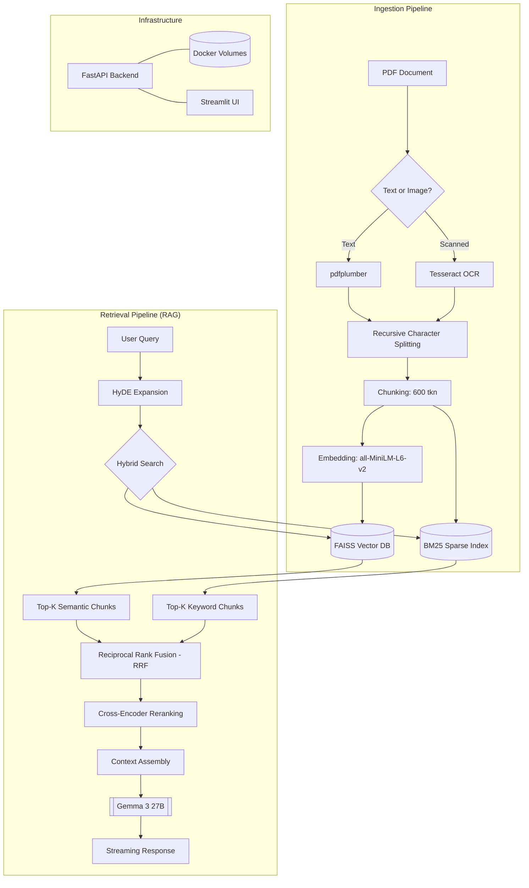

# 🧠 ChatWithPDF: Production-Grade RAG System

A robust, zero-hallucination RAG (Retrieval-Augmented Generation) system built for precision and speed. ChatWithPDF combines deep semantic search with traditional keyword matching to provide accurate answers from your documents.

## 🚀 Key Features

- **Hybrid Retrieval Pipeline**: Combines FAISS (dense) and BM25 (sparse) with **Reciprocal Rank Fusion (RRF)** for the highest recall.
- **Cross-Encoder Reranking**: Utilizes `ms-marco-MiniLM-L-6-v2` to re-score the top 25 chunks, ensuring the most relevant context is fed to the LLM.
- **Gemma 3 27B Intelligence**: Powered by Google's state-of-the-art **Gemma 3 27B** model via the `google-genai` SDK.
- **Zero-Hallucination Guardrails**: Strict context-grounding rules and prompt engineering to ensure the model only answers using provided data.
- **Hybrid PDF Processing**: Handles both text-based PDFs (pdfplumber) and scanned images (Tesseract OCR).
- **Asynchronous Token Streaming**: Real-time response generation for a smooth user experience.
- **Full Containerization**: One-click deployment with Docker Compose.

## 🏗 Architecture Diagram



## 🏗 Technology Stack

## 🛠 Setup & Installation

### 1. Prerequisites
- Docker & Docker Compose
- A Google Gemini API Key (obtain from [Google AI Studio](https://aistudio.google.com/))

### 2. Clone & Configure
```bash
git clone https://github.com/sharvmahajan/chatwithpdf.git
cd chatwithpdf
cp .env.example .env
```
Edit your `.env` and add your `GEMINI_API_KEY`.

### 3. Run with Docker
```bash
docker-compose up --build
```
- **Frontend**: [http://localhost:8501](http://localhost:8501)
- **API Docs**: [http://localhost:8000/docs](http://localhost:8000/docs)

## 📁 Project Structure

```text
├── app/
│   ├── api/            # FastAPI endpoints (chat, ingestion)
│   ├── core/           # Configuration & security
│   ├── services/       # Business logic (retrieval, llm, chunking, ocr)
│   └── main.py         # App entrypoint
├── frontend/           # Streamlit application
├── data/               # Persistent storage (PDFs, Vector Index)
├── Dockerfile          # Multi-stage build for OCR + Python
└── docker-compose.yml  # Orchestration logic
```

## ⚙️ How it Works

1. **Ingestion**: PDFs are split into 600-token chunks with 100-token overlap.
2. **Indexing**: Chunks are embedded and stored in FAISS, while concurrently building a BM25 index.
3. **Query Expansion (HyDE)**: The query is expanded into a hypothetical passage to improve search recall.
4. **Retrieval**:
   - FAISS finds the top semantic matches.
   - BM25 finds the top keyword matches.
   - RRF merges these lists.
5. **Reranking**: The Cross-Encoder model re-scores the merged list to find the absolute best 5 chunks.
6. **Generation**: Gemma 3 27B generates an answer using the reranked context with strict source citations.

---
Developed with ❤️ by Antigravity
